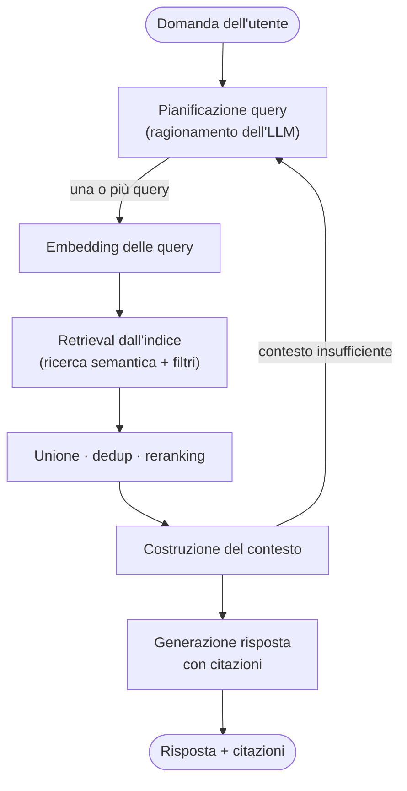

# Flusso di una domanda (RAG agentico)

L'assistente non embedda la domanda così com'è: prima **ragiona** sulla richiesta e ne deriva una o più query di ricerca mirate. È un flusso [RAG agentico](/glossario/rag-agentico.md).

1. L'utente pone una domanda in linguaggio naturale.
2. **Pianificazione delle query**: l'[LLM](/architettura/provider-llm.md) analizza la richiesta e produce una o più [query di ricerca](/architettura/pianificazione-query.md) sensate (riformulazioni, terminologia giuridica, sotto-domande), invece di usare il testo grezzo della domanda.
3. Ogni query viene **embeddata** ([embedding](/glossario/embedding.md)) e usata per recuperare i [Chunk](/modello-dati/chunk.md) più rilevanti dall'[indice](/architettura/indice-normativo.md) ([ricerca semantica](/glossario/ricerca-semantica.md) + filtri di [vigenza](/glossario/vigenza.md)).
4. I risultati delle varie query vengono **uniti, deduplicati e [rerankati](/glossario/reranking.md)**.
5. Il [backend](/architettura/backend-api.md) costruisce un contesto con i testi normativi e i relativi metadati di citazione.
6. Se il contesto è insufficiente, l'assistente può **iterare**: generare nuove query e tornare al passo 3.
7. L'LLM genera la risposta **citando** articolo, comma e fonte ([ELI](/glossario/eli.md)).
8. Il [frontend](/architettura/frontend.md) mostra la risposta con i link verificabili alle fonti.

Vedi [RAG](/glossario/rag.md), [pianificazione delle query](/architettura/pianificazione-query.md) e [citazione verificabile](/glossario/citazione-verificabile.md).
