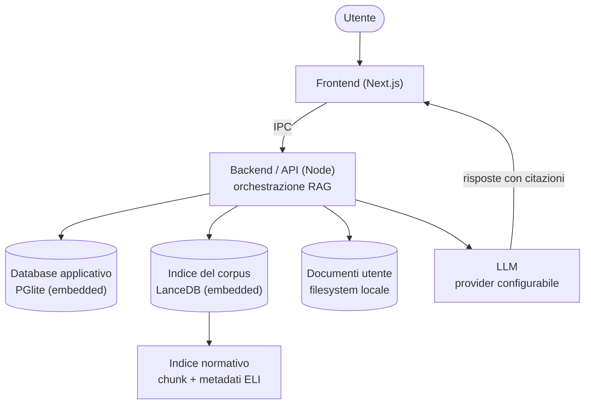

# Architettura

Bozza di architettura per Magistra. In questa fase serve a orientare le scelte; non è ancora un'implementazione.

## Vista d'insieme

Magistra è un'**app desktop** che gira interamente in locale: tutti i componenti sono impacchettati nel bundle dell'app, con il database applicativo **embedded** (PGlite), l'indice del corpus **embedded** (LanceDB) e i documenti dell'utente sul **filesystem locale**. Vedi [deployment](./deployment.md).

L'ingest pesante del corpus non gira insieme all'assistente: è un job **batch separato** (vedi [worker / runtime dei job](./worker-ingest.md)), così la chat resta reattiva.

## Concetti

- [Stack tecnologico (TypeScript-first)](./stack-tecnologico.md)
- [Frontend (Next.js)](./frontend.md)
- [Backend / API (Node)](./backend-api.md)
- [Worker / runtime dei job](./worker-ingest.md)
- [Indice normativo + Vector DB](./indice-normativo.md)
- [Database applicativo](./database-applicativo.md)
- [Archiviazione documenti (locale)](./archiviazione-documenti.md)
- [Provider LLM (configurabile)](./provider-llm.md)
- [Anonimizzazione reversibile dei dati sensibili](./anonimizzazione-reversibile.md)
- [Gestione delle API key](./gestione-api-key.md)
- [Conversione documenti](./conversione-documenti.md)
- [Pianificazione delle query](./pianificazione-query.md)
- [Flusso di una domanda (RAG agentico)](./flusso-rag.md)
- [Deployment](./deployment.md)

## Principi architetturali

- **App desktop locale**: Magistra è un'app installabile che gira interamente sulla macchina dell'utente, con i dati in locale.
- **Stack TypeScript-first**: un solo linguaggio end-to-end per abbassare la barriera d'ingresso della community OSS; scelta non ideologica e reversibile, con escape hatch verso altri runtime quando un requisito concreto lo giustifica (vedi [stack tecnologico](./stack-tecnologico.md)).
- **Separazione API / batch**: l'API in tempo reale e i job batch (ingest, embedding, reindex) girano in [processi separati](./worker-ingest.md), così l'assistente resta reattivo durante gli aggiornamenti del corpus.
- **Citazione prima di tutto**: nessuna risposta normativa senza fonte recuperata dall'indice.
- **Single-utente**: pensata per una sola persona sul proprio computer; non gestisce account, login né multi-utenza.
- **Separazione dati/modello**: la qualità dipende dai dati e dal retrieval, non solo dall'LLM.
- **Dati sotto il controllo dell'utente**: tutto gira e resta in locale sulla macchina dell'utente.
- **Confini dietro interfacce**: dati, indice, storage, provider LLM e trasporto UI ↔ backend sono raggiunti dietro interfacce tipizzate, così le implementazioni concrete (PGlite, LanceDB, filesystem, IPC) restano isolate e sostituibili (vedi [stack tecnologico](./stack-tecnologico.md)).
