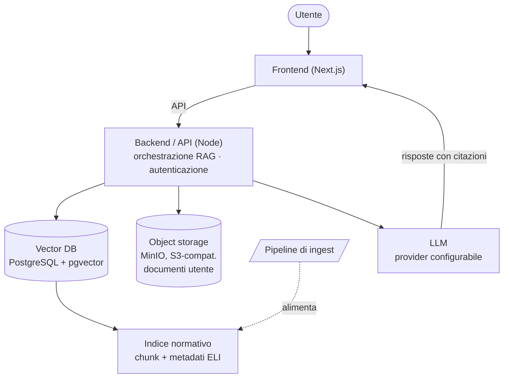

# Architettura

Bozza di architettura per Italian-OSS-Legal-Platform. In questa fase serve a orientare le scelte; non è ancora un'implementazione.

## Vista d'insieme

## Concetti

- [Frontend (Next.js)](/architettura/frontend.md)
- [Backend / API (Node)](/architettura/backend-api.md)
- [Indice normativo + Vector DB](/architettura/indice-normativo.md)
- [Object storage (S3-compatibile)](/architettura/object-storage.md)
- [Provider LLM (configurabile)](/architettura/provider-llm.md)
- [Flusso di una domanda (RAG)](/architettura/flusso-rag.md)

## Principi architetturali

- **Citazione prima di tutto**: nessuna risposta normativa senza fonte recuperata dall'indice.
- **Separazione dati/modello**: la qualità dipende dai dati e dal retrieval, non solo dall'LLM.
- **Self-hosting possibile**: l'architettura deve poter girare interamente sotto il controllo dell'utente.
- **Modularità**: provider LLM, storage e database intercambiabili.
