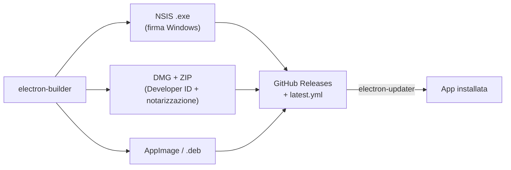

# Packaging e distribuzione desktop

Questo documento di design risolve i dettagli di packaging lasciati aperti dal [deployment](./deployment.md): il [framework desktop](#framework-desktop-electron), il modo in cui il [frontend](#packaging-del-frontend-build-vite) viene impacchettato in locale, i [formati di installazione](#formati-di-installazione-per-os) per ogni OS, la [firma del codice](#firma-del-codice) e l'[auto-update](#auto-update).
Le scelte qui descritte sono coerenti con lo [stack TypeScript-first](./stack-tecnologico.md) e con un'app che gira **interamente in locale**.

## Framework desktop: Electron

Il framework desktop è **Electron** (confermato, non più solo candidato).
L'alternativa valutata è **Tauri**: produce bundle più piccoli e con minore impronta di memoria, ma il suo backend è in **Rust** e il modello a WebView di sistema non ospita in-process un backend Node.

Per Magistra la differenza è dirimente, perché il backend non è un involucro sottile ma esegue logica Node in-process:

- l'[orchestrazione RAG](./backend-api.md) e il [worker di ingest](./worker-ingest.md) sono TypeScript/Node;
- il [database applicativo](./database-applicativo.md) è **PGlite** (Postgres in WASM, richiede un runtime Node/JS);
- l'[indice del corpus](./indice-normativo.md) è **LanceDB**, modulo nativo caricato in-process;
- la [conversione documenti](./conversione-documenti.md) invoca **LibreOffice headless** come sottoprocesso.

Electron include **Node** nel processo principale, quindi tutto questo resta dentro il bundle e in **TypeScript**, senza riscrivere il backend in Rust.
Scegliere Tauri costringerebbe a spostare la logica di dominio fuori dallo stack TS, in contrasto con il principio [TypeScript-first](./stack-tecnologico.md): il maggiore peso del bundle Electron è il prezzo accettato per questa coerenza.
Electron resta comunque dietro i [confini tipizzati](./stack-tecnologico.md) (IPC, interfacce di dati e indice), quindi è un dettaglio sostituibile e non contamina il core di orchestrazione.

## Packaging del frontend: build Vite

Il [frontend React](./frontend.md) è costruito con **Vite** in un **bundle statico** (HTML/JS/CSS), incluso nel bundle dell'app e caricato nel renderer di Electron tramite un **protocollo applicativo locale** (es. `app://`), senza alcun server.

La scelta è imposta dall'architettura, non è una preferenza:

- il [backend «API»](./backend-api.md) **non** è un server HTTP e **non** apre porte su `localhost`; la UI invoca le operazioni via **IPC**, non via `fetch`;
- di conseguenza **non gira alcun runtime server** lato frontend: niente SSR, niente API route.

L'alternativa — un **framework full-stack con server Node embedded** nel processo principale — è **scartata**: aprirebbe una porta HTTP su `localhost`, aumentando la superficie d'attacco (vedi [sicurezza](../requisiti/sicurezza.md)) e duplicando un trasporto di rete dove l'IPC è già sufficiente per un'app **single-utente** locale.
Vite mantiene il frontend un puro insieme di asset statici: il renderer mostra la UI, ogni logica passa per l'IPC verso il backend, e i [componenti UI](./frontend.md) restano in una libreria separata e portabile.

## Strumenti di build: Vite + electron-builder

Due strumenti complementari con ruoli distinti:

- la **build del codice** (processo main, preload e renderer) usa **Vite**, via **electron-vite**, che gestisce correttamente i tre contesti di Electron con HMR in sviluppo;
- il **packaging** dei binari in installer per OS, la firma e l'auto-update usano **electron-builder** con **electron-updater**.
Rispetto a Electron Forge, electron-builder offre **out of the box** la triade che serve qui — generazione dei formati per OS, **firma** cross-platform e **auto-update** — con un'unica configurazione, mentre con Forge l'auto-update richiede cablaggio aggiuntivo.
È inoltre lo standard de facto per app Electron distribuite fuori dagli store.

## Formati di installazione per OS

Magistra prende di mira **Windows, macOS e Linux**.
Per ogni OS si sceglie il formato che supporta l'[auto-update](#auto-update) (Squirrel.Windows è deprecato e non adottato):

| OS | Formato distribuito | Note |
|---|---|---|
| **Windows** | Installer **NSIS** (`.exe`) | Installazione per-utente senza privilegi di amministratore; compatibile con l'auto-update. |
| **macOS** | **DMG** per la distribuzione + **ZIP** per l'updater | Build **universale** (x64 + arm64) per coprire Intel e Apple Silicon; lo ZIP firmato è il pacchetto usato dall'updater. |
| **Linux** | **AppImage** (primario), opzionale **.deb** | L'AppImage è autocontenuto e supporta l'auto-update; i pacchetti `.deb` restano un'opzione per chi preferisce il gestore di sistema. |

## Firma del codice

La firma è un **prerequisito di distribuzione**, non un optional: senza firma i sistemi operativi mostrano avvisi bloccanti e l'auto-update di macOS non funziona.

- **macOS** — firma con un certificato **Developer ID Application** e **notarizzazione** presso Apple (via `notarytool`), con **Hardened Runtime** attivo e le entitlement minime necessarie; il **ticket** di notarizzazione viene «stapled» al bundle, così la verifica passa anche offline. electron-builder automatizza firma, notarizzazione e stapling.
- **Windows** — firma **Authenticode** con un certificato di code signing. Da fine 2024 i certificati **EV non garantiscono più il bypass immediato di SmartScreen**: la reputazione si costruisce nel tempo come per i certificati OV. Per un progetto open source il percorso più sostenibile è **Azure Trusted Signing** (firma gestita, basso costo ricorrente), tenendo presente che la firma Authenticode richiede comunque una CA del Microsoft Trusted Root Program: soluzioni keyless come Sigstore **non** sono adatte agli eseguibili Windows.

La firma comporta costi e identità d'organizzazione (account Apple Developer, certificato/identità di firma Windows): è un onere noto a carico di chi pubblica le release ufficiali, distinto dalla possibilità per la community di buildare l'app dai sorgenti.

## Auto-update

L'aggiornamento dell'app usa **electron-updater** con **GitHub Releases** come canale di distribuzione, coerente con un progetto open source ospitato su GitHub.
electron-builder pubblica insieme agli artefatti i file di metadati dell'updater (`latest.yml`, `latest-mac.yml`): all'avvio l'app li confronta con la versione installata, scarica in background il pacchetto firmato e lo applica al riavvio.
L'auto-update richiede artefatti **firmati** (vedi sopra), soprattutto su macOS.

L'aggiornamento dell'**applicazione** è distinto dall'aggiornamento dell'**[indice normativo](./indice-normativo.md)**: l'indice già "ingestato" viene distribuito e aggiornato separatamente (vedi [deployment — indice già pronto](./deployment.md)), così una nuova versione del corpus non impone una nuova build dell'app e viceversa.

