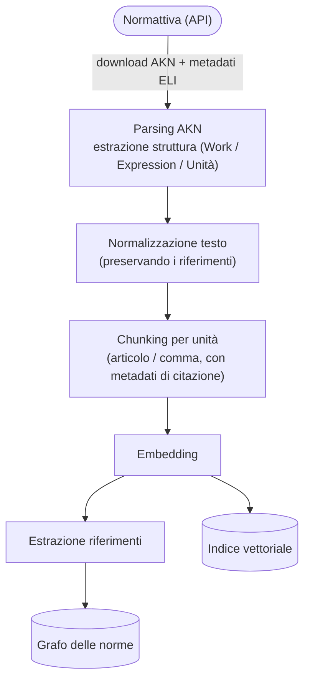

# Pipeline di trasformazione

**Principio chiave**: ogni [Chunk](/modello-dati/chunk.md) porta con sé i metadati necessari a costruire una **[citazione verificabile](/glossario/citazione-verificabile.md)** ([ELI](/glossario/eli.md) + articolo + comma + data di vigenza). Senza questi metadati il chunk non entra nell'indice.

Le fasi attingono dalla fonte [Normattiva](/fonti/normattiva.md) e alimentano l'[indice normativo](/architettura/indice-normativo.md).
